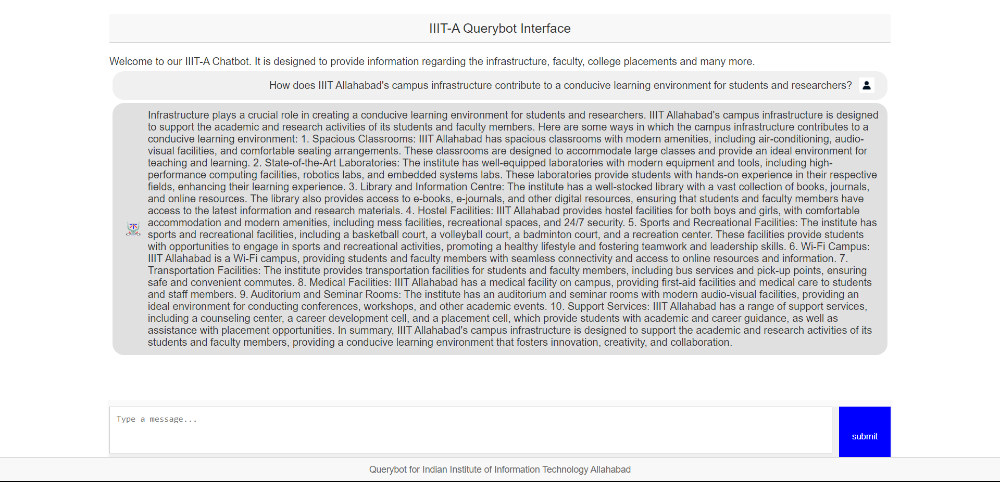

# IIITA-Querybot
IIITA-Querybot is a tool designed for students to easily access information about infrastructure, faculty, academics, placements, hostel, campus and more at IIIT-Allahabad.




## Project Breakdown
- **Research and Data Collection** - We gathered comprehensive information about IIIT-Allahabad from the college's official websites such as (iiita.ac.in) and then we scraped the data and stored it in a csv file. An example file `data.csv` can be found in the repository.
- **Cleaning and Verifying Dataset** - After collecting the dataset, we cleaned the dataset, removing any errors and mistakes. We also checked the information ourselves to make sure it was correct and reliable. 
- **Fine-Tuning LLM model** - We used `Llama-2 7B chat hf` model [Link](https://huggingface.co/meta-llama/Llama-2-7b-chat-hf) for fine-tuning. Since this model performs well in text generation and improved word processing performance compared to other models. The model was trained on our custom dataset and can be accessed from huggingface [Link](https://huggingface.co/sohamslc5/new_llama_new).
- **Evaluation of the trained model** - We used the ROUGE score [Github Link](https://github.com/google-research/google-research/tree/master/rouge) for evaluating the accuracy and performance of our trained model. 
- **Testing of the trained model** - The Trained model was tested on random 100 queries from the training dataset itself. We verified the accuracy of our model by manually comparing the generated output with actual reference.
- **Deployment** - The website was deployed using Flask, a web framework for python. We utilized Flask's simplicity to deploy our application seamlessly on a web server.

### Dataset format
```
<s>
[INST]
  <<SYS>>
      {{ system_prompt }}
  <</SYS>>
      {{ user_message }}
[/INST]
      {{ generated_text }}
</s>
```

## Steps to Run the Project
Follow these steps to run the IIITA-QueryBot project on your local machine:
1. **Clone the repository** - Enter the following command in your command prompt to clone the repo:
```
git clone https://github.com/Ashborn47/IIITA-Querybot.git
```
2. **Navigate to the Project Directory:**
```
cd "IIITA-Querybot"
```
3. **Login to huggingface-cli** - Enter your huggingface access token:
```
huggingface-cli login
```
4. **Execute app.py** - Once executed, the base Llama 2 model will be downloaded and the trained model weights will be added to it.
```
python app.py
```
5. **Open the website** - After clicking the link in the terminal, your web browser will automatically open and navigate to the website and then you can enter you query and get the output.

We express our sincere gratitude to our project guide for their support, Meta for the Llama 2 Model and Hugging Face for their diverse range of libraries and tools.
